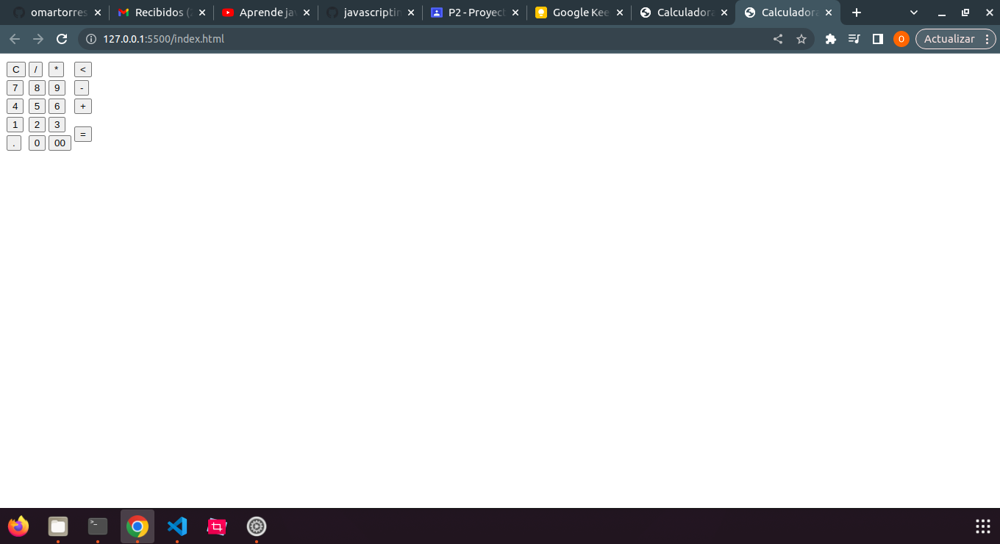
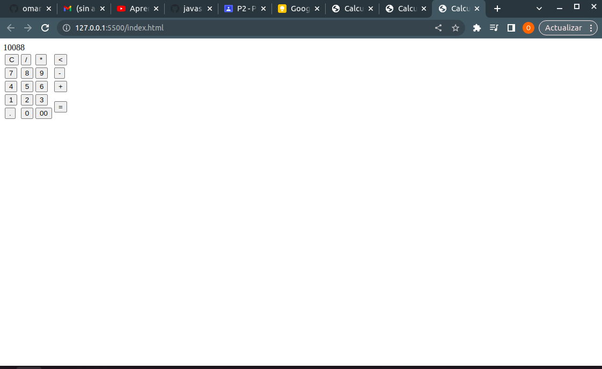
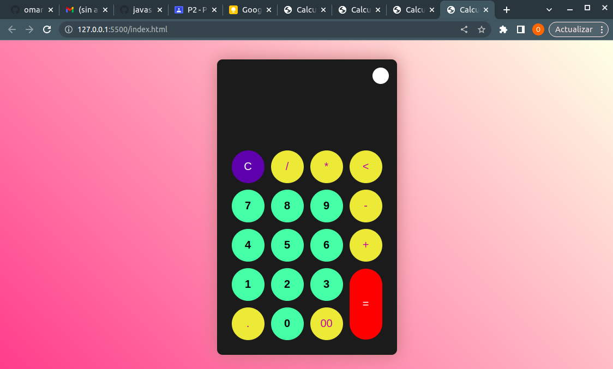
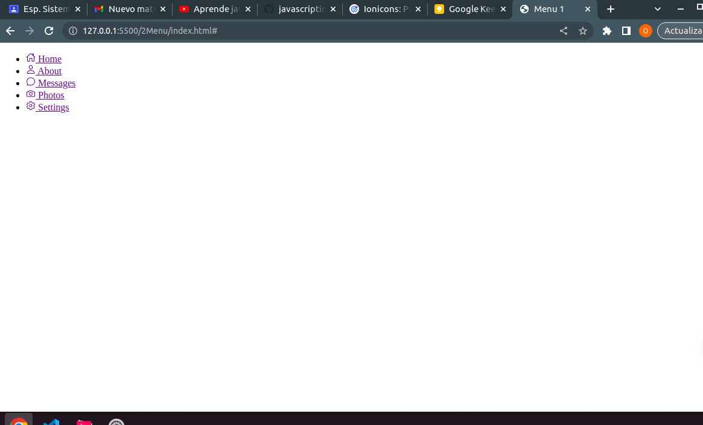
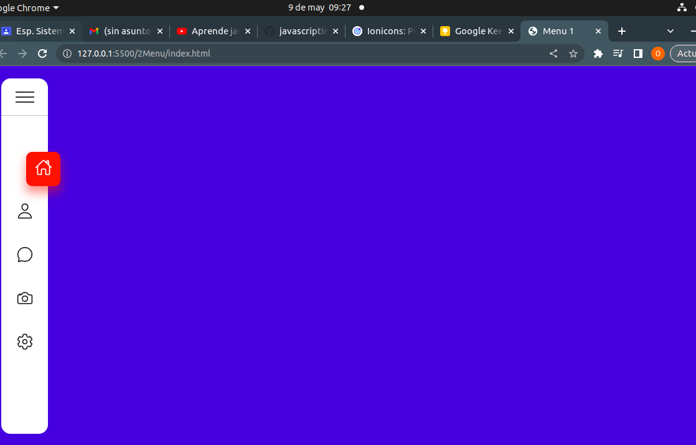
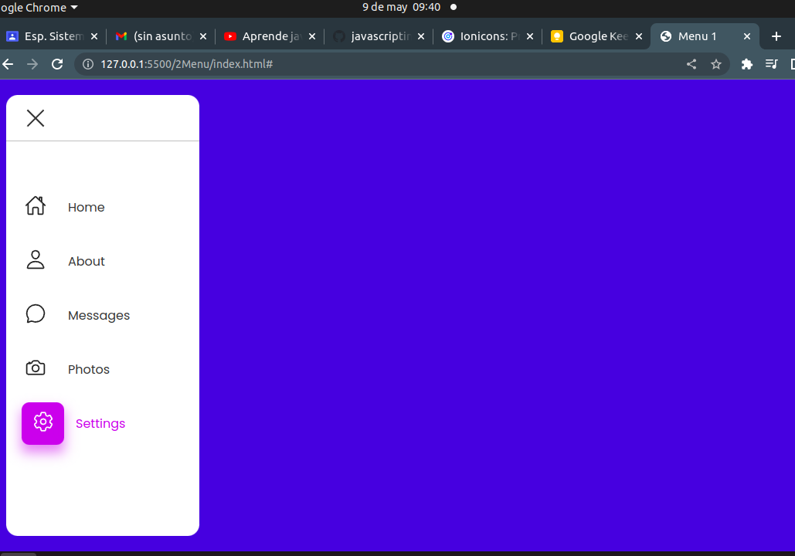

# Taller video js

# EJERCICIO 1 (CALCULADORA)

### Este sitio web se basa en una calculadora personalizable en la cual nos enseña como hacer que su color cambie y al mismo tiempo personalizarla.

# index

### El index es la parte de maquetación en donde se inserta en codigo tecnicamente el esqueleto sin funcionalidad de sus botones ni color.

# script js

### En el script se implementa la funcion de los botones aun sin color ni nada solo el uso de botones y la logica de signos.

# Agregado css

### Se importora el estilo y la parte grafica, tecnicamente la estructura el cual le da colores mas llamativos.

# EJERCICIO 2 (MENU)

### se crea principalmente las carpetas en donde se va a almacenar el codigo, se busca ionicons en donde se va a buscar los simbolos que se implementaran en cada una de las frases del menu.

# index

### En la parte lateral empezamos con la implementación de las opciones que tendra nuestro menu tales como mensajes, configuraciones, etc. ademas se implementan los iconos correspondientes a sus funciones.

# Css

### EL scss nos ayuda con el tipo de letra poppins, le da color al fondo y implenta el color blanco en la barra lateral, ademas modifica los pixeles y da un buen posicionamiento de las opciones que estan en el menu, ademas en esta parte el scss le da color a los iconos que tenemos en la barra lateral .

# script js

### Se usa para mapear todas clases que tengamos lo cual hace que se activen las acciones que se proponen en style css tales como los elementos que estan en la barra de navegacion y activa los textos y para que cada elemento sirva se inserta las constante list.

# EJERCICIO 3