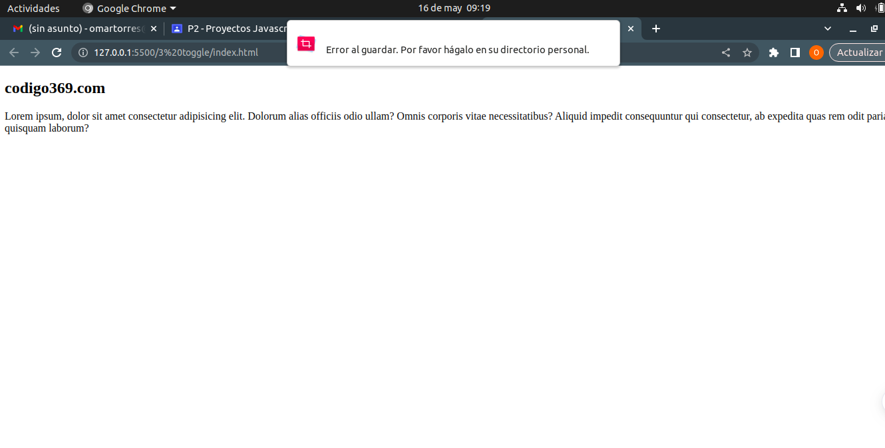
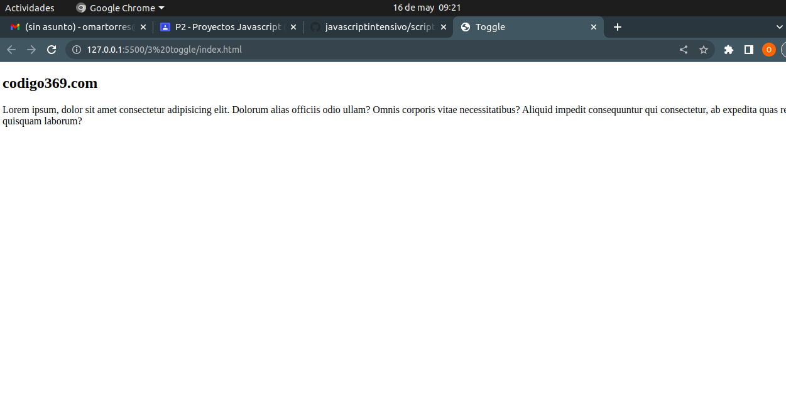
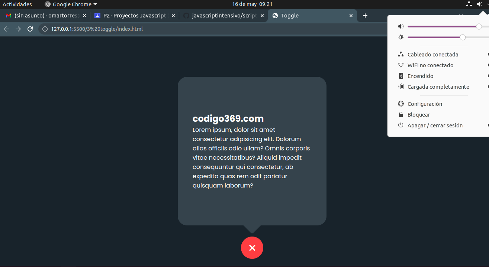
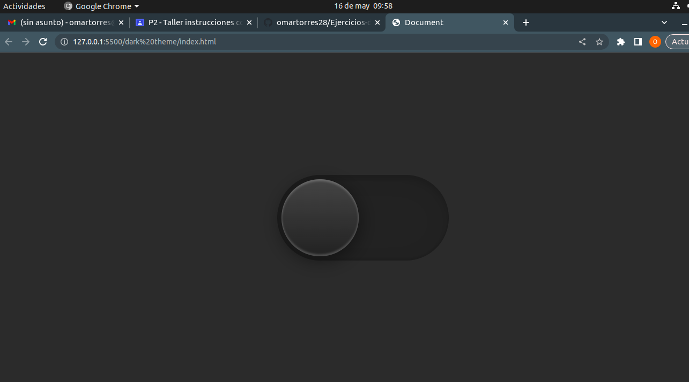

# Taller video js

# EJERCICIO 1 (CALCULADORA)

### Este sitio web se basa en una calculadora personalizable en la cual nos enseña como hacer que su color cambie y al mismo tiempo personalizarla.

# index

### El index es la parte de maquetación en donde se inserta en codigo tecnicamente el esqueleto sin funcionalidad de sus botones ni color.

# script js

### En el script se implementa la funcion de los botones aun sin color ni nada solo el uso de botones y la logica de signos.

# Agregado css

### Se importora el estilo y la parte grafica, tecnicamente la estructura el cual le da colores mas llamativos.

# EJERCICIO 2 (MENU)

### se crea principalmente las carpetas en donde se va a almacenar el codigo, se busca ionicons en donde se va a buscar los simbolos que se implementaran en cada una de las frases del menu.

# index

### En la parte lateral empezamos con la implementación de las opciones que tendra nuestro menu tales como mensajes, configuraciones, etc. ademas se implementan los iconos correspondientes a sus funciones.

# Css

### EL scss nos ayuda con el tipo de letra poppins, le da color al fondo y implenta el color blanco en la barra lateral, ademas modifica los pixeles y da un buen posicionamiento de las opciones que estan en el menu, ademas en esta parte el scss le da color a los iconos que tenemos en la barra lateral .

# script js

### Se usa para mapear todas clases que tengamos lo cual hace que se activen las acciones que se proponen en style css tales como los elementos que estan en la barra de navegacion y activa los textos y para que cada elemento sirva se inserta las constante list.

# EJERCICIO 3 (Toggle)
### se basa en un mecanismo el cual al darle clic abre la ventana donde esta un texto con informacion el cual hace una transicion.

# index

### La etiqueta  indica que el documento es un archivo HTML. Las etiquetas html, head, meta, title, link y body son algunas de las etiquetas que se utilizan para estructurar la página web y agregar información adicional, como el título y los estilos. La etiqueta body es donde se coloca todo el contenido visible de la página web.

# script js

### cuando se hace clic en el botón con la clase .toggleBtn, se agrega o se quita la clase .active del elemento HTML con la clase .container. Esto permite mostrar u ocultar el contenido dentro del contenedor.

# css

### Este es un código que se utiliza para dar estilo a una página web. Se utilizan diferentes selectores para aplicar estilos a elementos específicos de la página, como el cuerpo de la página, un contenedor y sus elementos internos. Los estilos incluyen propiedades como el color de fondo, la altura y el ancho, la posición, el tamaño de fuente, la opacidad y las transformaciones.

# EJERCICIO 4 (DARK THEME)

# Ejercicio 4 
# Index
### Este código es para una página web en español. Contiene etiquetas HTML que definen la estructura de la página, así como información importante como la hoja de estilos, el título de la página y la codificación utilizada. También hay un botón con un ícono que se puede hacer clic para activar una función y un archivo JavaScript vinculado a la página.
[dark](img/dark1.png "dark")

# Style(css,css.map,scss)
## Los códigos anteriores son para una página web que tiene un botón que cambia de color y forma cuando se hace clic en él. Aquí te explico cómo funciona cada uno de los códigos:

## HTML:

### El código HTML define la estructura de la página y contiene etiquetas que definen el título, la hoja de estilos y el botón. La función del botón es activar una clase "active" en el cuerpo de la página y en el botón mismo.
## CSS:

### El código CSS define el estilo visual de la página, incluyendo el diseño del botón y el fondo de la página.La función del CSS es hacer que el botón cambie de color y forma cuando se activa la clase "active" en el cuerpo de la página y en el botón mismo.
## JavaScript:

### El código JavaScript define la funcionalidad del botón, permitiendo que se active la clase "active" en el cuerpo de la página y en el botón mismo cuando se hace clic en él. En resumen, estos códigos trabajan juntos para crear un botón interactivo que cambia de color y forma cuando se hace clic en él, y también cambia el fondo de la página.

